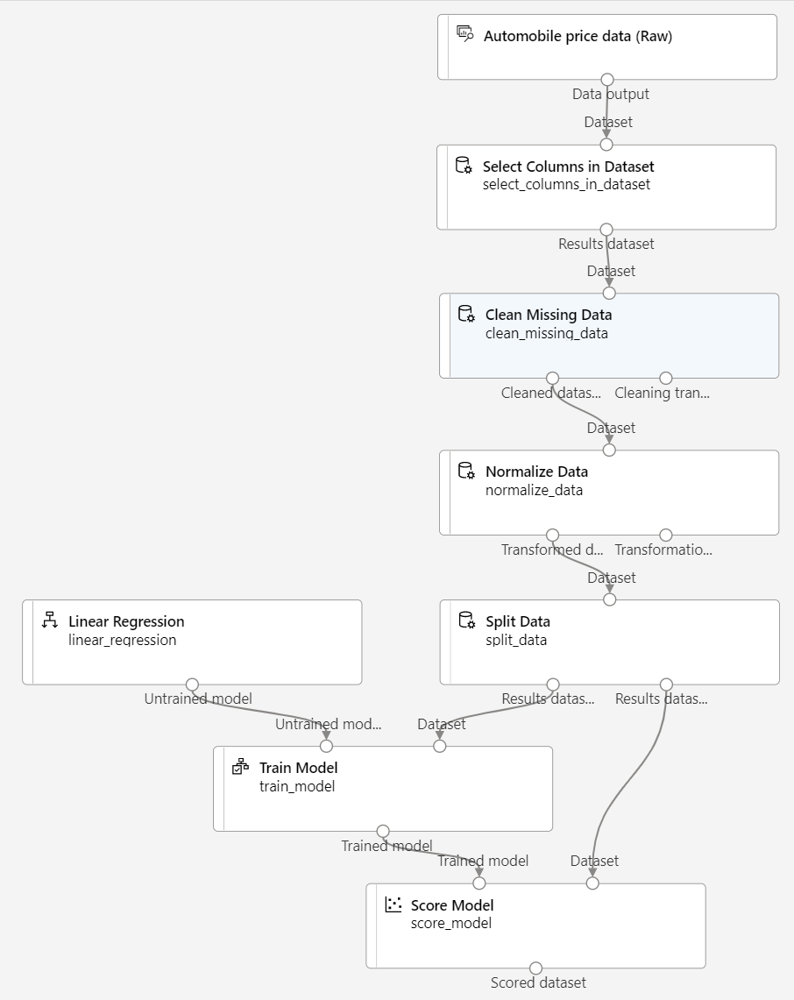

---
lab:
    title: 'Explore regression with Azure Machine Learning Designer'
---

# Explore regression with Azure Machine Learning Designer

> **Note**
> To complete this lab, you will need an [Azure subscription](https://azure.microsoft.com/free?azure-portal=true) in which you have administrative access.

In this exercise, you will train a regression model that predicts the price of an automobile based on its characteristics.

## Create an Azure Machine Learning workspace  

1. Sign into the [Azure portal](https://portal.azure.com?azure-portal=true) using your Microsoft credentials.

1. Select **+ Create a resource**, search for *Machine Learning*, and create a new **Azure Machine Learning** resource with an *Azure Machine Learning* plan. Use the following settings:
    - **Subscription**: *Your Azure subscription*.
    - **Resource group**: *Create or select a resource group*.
    - **Workspace name**: *Enter a unique name for your workspace*.
    - **Region**: *Select the closest geographical region*.
    - **Storage account**: *Note the default new storage account that will be created for your workspace*.
    - **Key vault**: *Note the default new key vault that will be created for your workspace*.
    - **Application insights**: *Note the default new application insights resource that will be created for your workspace*.
    - **Container registry**: None (*one will be created automatically the first time you deploy a model to a container*)

1. Select **Review + create**, then select **Create**. Wait for your workspace to be created (it can take a few minutes), and then go to the deployed resource.

1. Select **Launch studio** (or open a new browser tab and navigate to [https://ml.azure.com](https://ml.azure.com?azure-portal=true), and sign into Azure Machine Learning studio using your Microsoft account).

1. In Azure Machine Learning studio, you should see your newly created workspace. If that is not the case, select your Azure directory in the left-hand menu. Then from the new left-hand menu select **Workspaces**, where all the workspaces associated to your directory are listed, and select the one you created for this exercise.

> **Note**
> This module is one of many that make use of an Azure Machine Learning workspace, including the other modules in the [Microsoft Azure AI Fundamentals: Explore visual tools for machine learning](https://docs.microsoft.com/learn/paths/create-no-code-predictive-models-azure-machine-learning/) learning path. If you are using your own Azure subscription, you may consider creating the workspace once and reusing it in other modules. Your Azure subscription will be charged a small amount for data storage as long as the Azure Machine Learning workspace exists in your subscription, so we recommend you delete the Azure Machine Learning workspace when it is no longer required.

## Create compute

1. In [Azure Machine Learning studio](https://ml.azure.com?azure-portal=true), select the **&#8801;** icon (a menu icon that looks like a stack of three lines) at the top left to view the various pages in the interface (you may need to maximize the size of your screen). You can use these pages in the left hand pane to manage the resources in your workspace. Select the **Compute** page (under **Manage**).

1. On the **Compute** page, select the **Compute clusters** tab, and add a new compute cluster with the following settings to train a machine learning model:
    - **Location**: *Select the same as your workspace. If that location is not listed, choose the one closest to you*.
    - **Virtual machine tier**: Dedicated
    - **Virtual machine type**: CPU
    - **Virtual machine size**:
        - Choose **Select from all options**
        - Search for and select **Standard_DS11_v2**
    - Select **Next**
    - **Compute name**: *enter a unique name*
    - **Minimum number of nodes**: 0
    - **Maximum number of nodes**: 2
    - **Idle seconds before scale down**: 120
    - **Enable SSH access**: Clear
    - Select **Create**

> **Note**
> Compute instances and clusters are based on standard Azure virtual machine images. For this module, the *Standard_DS11_v2* image is recommended to achieve the optimal balance of cost and performance. If your subscription has a quota that does not include this image, choose an alternative image; but bear in mind that a larger image may incur higher cost and a smaller image may not be sufficient to complete the tasks. Alternatively, ask your Azure administrator to extend your quota.

The compute cluster will take some time to be created. You can move onto the next step while you wait.

## Create a pipeline in Designer and add a dataset

Azure Machine Learning includes a sample dataset that you can use for your regression model.

1. In [Azure Machine Learning studio](https://ml.azure.com?azure-portal=true), expand the left pane by selecting the menu icon at the top left of the screen. View the **Designer** page (under **Authoring**), and select **+** to create a new pipeline.

1. Change the draft name (**Pipeline-Created-on-*date***) to **Auto Price Training**.

1. Next to the pipeline name on the left, select the arrows icon to expand the panel if it is not already expanded. The panel should open by default to the **Asset library** pane, indicated by the books icon at the top of the panel. There is a search bar to locate assets on the pane and two buttons, **Data** and **Component**.

    

1. Select **Component**. Search for and place the **Automobile price data (Raw)** dataset onto the canvas.

1. Right-click (Ctrl+click on a Mac) the **Automobile price data (Raw)** dataset on the canvas, and select **Preview data**.

1. Review the *Dataset output* schema of the data, noting that you can see the distributions of the various columns as histograms.

1. Scroll to the right of the dataset until you see the **Price** column, which is the label that your model predicts.

1. Scroll back to the left and select the **normalized-losses** column header. Then review the statistics for this column. Note there are quite a few missing values in this column. Missing values  limit the column's usefulness for predicting the **price** label so you might want to exclude it from training.

1. Close the **DataOutput** window so that you can see the dataset on the canvas like this:

    

## Add data transformations

You typically apply data transformations to prepare the data for modeling. In the case of the automobile price data, you add transformations to address the issues you identified when you explored the data.

1. In the **Asset library** pane on the left, select **Component**, which contain a wide range of modules you can use for data transformation and model training. You can also use the search bar to quickly locate modules.

1. Search for a **Select Columns in Dataset** module and place it to the canvas, below the **Automobile price data (Raw)** module. Then connect the output at the bottom of the **Automobile price data (Raw)** module to the input at the top of the **Select Columns in Dataset** module, like this:

    

1. Double click on the **Select Columns in Dataset** module to access a settings pane on the right. Select **Edit column**. Then in the **Select columns** window, select **By name** and **Add all** to add all the columns. Then remove **normalized-losses**, so your final column selection looks like this:

    

1. Select **Save** and close the proprietes window.

In the rest of this exercise, you´ll go through steps to create a pipeline that should looks like this:

Follow the remaining steps, use the image for reference as you add and configure the required modules.

1. In the **Asset library**, search for a **Clean Missing Data** module and place it under the **Select Columns in Dataset** module on the canvas. Then connect the output from the **Select Columns in Dataset** module to the input of the **Clean Missing Data** module.

1. Double click the **Clean Missing Data** module, and in the pane on the right, select **Edit column**. Then in the **Columns to be cleaned** window, select **With rules**, in the **Include** list select **Column names**, in the box of column names enter **bore**, **stroke**, and **horsepower** like this:

    

1. With the **Clean Missing Data** module still selected, in the pane on the right, set the following configuration settings:
    - **Minimum missing value ratio**: 0.0
    - **Maximum missing value ratio**: 1.0
    - **Cleaning mode**: Remove entire row

    >**Tip**
    >If you view the statistics for the **bore**, **stroke**, and **horsepower** columns, you'll see a number of missing values. These columns have fewer missing values than **normalized-losses**, so they might still be useful in predicting **price** once you exclude the rows where the values are missing from training.

1. In the **Asset library**, search for a **Normalize Data** module and place it on the canvas, below the **Clean Missing Data** module. Then connect the left-most output from the **Clean Missing Data** module to the input of the **Normalize Data** module.

1. Double click on the **Normalize Data** module to view its parameters pane. You will need to specify the transformation method and the columns to be transformed. Set the transformation method to **MinMax**. Apply a rule by selecting **Edit column** to include the following **Column names**:
    - **symboling**
    - **wheel-base**
    - **length**
    - **width**
    - **height**
    - **curb-weight**
    - **engine-size**
    - **bore**
    - **stroke**
    - **compression-ratio**
    - **horsepower**
    - **peak-rpm**
    - **city-mpg**
    - **highway-mpg**

    

    >**Tip**
    >If you compare the values in the **stroke**, **peak-rpm**, and **city-mpg** columns, they are all measured in different scales, and it is possible that the larger values for **peak-rpm** might bias the training algorithm and create an over-dependency on this column compared to columns with lower values, such as **stroke**. Typically, data scientists mitigate this possible bias by *normalizing* the numeric columns so they're on the similar scales.

## Run the pipeline

To apply your data transformations, you must run the pipeline.

1. Ensure that your pipeline looks similar to this image:

    

1. Select **Configure & Submit** at the top of the page to open the **Set up pipeline job** dialogue.

1. On the **Basics** page select **Create new** and set the name of the experiment to **mslearn-auto-training** then select **Next** .

1. On the **Inputs & outputs** page select **Next** without making any changes.

1. On the **Runtime settings** page an error appears as you don´t have a default compute to run the pipeline. In the **Select compute type** drop-down select *Compute cluster* and in the **Select Azure ML compute cluster** drop-down select your recently created compute cluster.

1. Select **Next** to review the pipeline job and then select **Submit** to run the training pipeline.

1. Wait a few minutes for the run to finish. You can check the status of the job by selecting **Jobs** under the **Assets**. From there, select the **Auto Price Training** job. From here, you can see when the job is complete. Once the job is complete, the dataset is now prepared for model training.

1. Go to the left-hand menu. Under **Authoring** select **Designer**. Then select your *Auto Price Training* pipeline from the list of **Pipelines**.

## Create training pipeline

After you've used data transformations to prepare the data, you can use it to train a machine learning model. Work through the following steps to extend the **Auto Price Training** pipeline.

1. Make sure the left-hand menu has **Designer** selected and that you have returned to the **Auto Price Training** pipeline.

1. In the **Asset library** pane on the left, search for and place a **Split Data** module onto the canvas under the **Normalize Data** module. Then connect the *Transformed Dataset* (left) output of the **Normalize Data** module to the input of the **Split Data** module.

    >**Tip**
    > Use the search bar to quickly locate modules. 

1. Double click on the **Split Data** module, and configure its settings as follows:
    - **Splitting mode**: Split Rows
    - **Fraction of rows in the first output dataset**: 0.7
    - **Randomized split**: True
    - **Random seed**: 123
    - **Stratified split**: False

1. In the **Asset library**, search for and place a **Train Model** module to the canvas, under the **Split Data** module. Then connect the *Results dataset1* (left) output of the **Split Data** module to the *Dataset* (right) input of the **Train Model** module.

1. The model you are training will predict the **price** value, so select the **Train Model** module and modify its settings to set the **Label column** to  **price** (matching the case and spelling exactly!)

    The **price** label the model will predict is a numeric value, so we need to train the model using a *regression* algorithm.

1. In the **Asset library**, search for and place a **Linear Regression** module to the canvas, to the left of the **Split Data** module and above the **Train Model** module. Then connect its output to the **Untrained model** (left) input of the **Train Model** module.

    > **Note**
    > There are multiple algorithms you can use to train a regression model. For help choosing one, take a look at the [Machine Learning Algorithm Cheat Sheet for Azure Machine Learning designer](https://aka.ms/mlcheatsheet?azure-portal=true).

    To test the trained model, we need to use it to *score* the validation dataset we held back when we split the original data - in other words, predict labels for the features in the validation dataset.
 
1. In the **Asset library**, search for and place a **Score Model** module to the canvas, below the **Train Model** module. Then connect the output of the **Train Model** module to the **Trained model** (left) input of the **Score Model** module; and drag the **Results dataset2** (right) output of the **Split Data** module to the **Dataset** (right) input of the **Score Model** module.

1. Ensure your pipeline looks like this image:

    

## Run the training pipeline

Now you're ready to run the training pipeline and train the model.

1. Select **Configure & Submit**, and run the pipeline using the existing experiment named **mslearn-auto-training**.

1. The experiment run will take 5 minutes or more to complete. Return to the **Jobs** page and select the latest **Auto Price Training** job run.

1. When the experiment run has completed, right click on the **Score Model** module and select **Preview data** and then **Scored dataset** to view the results.

1. Scroll to the right, and note that next to the **price** column (which contains the known true values of the label) there is a new column named **Scored Labels**, which contains the predicted label values.

1. Close the **scored_dataset** tab.

The model is predicting values for the **price** label, but how reliable are its predictions? To assess that, you need to evaluate the model.

## Evaluate model

One way to evaluate a regression model is to compare the predicted labels to the actual labels in the validation dataset that was held back during training. Another way is to compare the performance of multiple models.

1. Open the **Auto Price Training** pipeline you created.

1. In the **Asset library**, search for and place an **Evaluate Model** module to the canvas, under the **Score Model** module, and connect the output of the **Score Model** module to the **Scored dataset** (left) input of the **Evaluate Model** module.

1. Ensure your pipeline looks like this:

    

1. Select **Configure & Submit**, and run the pipeline using the existing experiment named **mslearn-auto-training**.

1. The experiment run will take a couple of minutes to complete. Return to the **Jobs** page and select the latest **Auto Price Training** job run.

1. When the experiment run has completed, select **Job detail**, which will open another tab. Find and right click on the **Evaluate Model** module. Select **Preview data** and then **Evaluation results**.

    

1. In the *Evaluation_results* pane, review the regression performance metrics:
    - **Mean Absolute Error (MAE)**
    - **Root Mean Squared Error (RMSE)**
    - **Relative Squared Error (RSE)**
    - **Relative Absolute Error (RAE)**
    - **Coefficient of Determination (R2)**
1. Close the *Evaluation_results* pane.

When you've identified a model with evaluation metrics that meet your needs, you can prepare to use that model with new data.

> To delete your workspace:
>
> 1. In the [Azure portal](https://portal.azure.com?azure-portal=true), in the **Resource groups** page, open the resource group you specified when creating your Azure Machine Learning workspace.
> 1. Click **Delete resource group**, type the resource group name to confirm you want to delete it, and select **Delete**.
